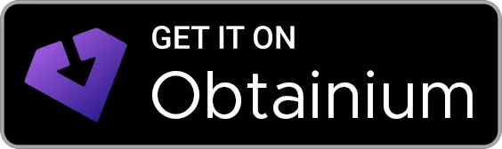

  

<h1 align=center>Octo8</h1>

An app to check current splatoon 3 map schedules made with kotlin and jetpack compose

# Download:

Debug releases:<a href="https://nightly.link/ThePowerdinoDeluxe990/Octo8/workflows/main/master"> Here</i>

## Screenshots:

TODO: 
* Events schedules
* Support for diferent languages

API: https://splatoon.oatmealdome.me/

Assets: https://splatoonwiki.org/

This app is not affiliated with Nintendo. All product names, logos, and brands are property of their respective owners.
